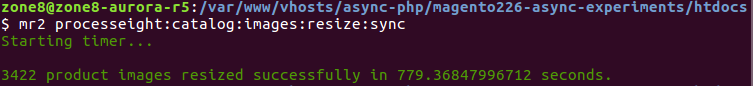
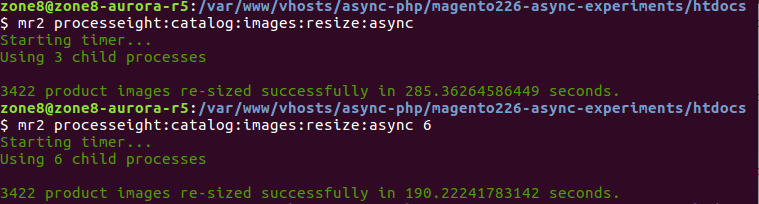

## Through the Looking Glass: Adventures in Asynchronous PHP Land

Simon Frost

---

# About me

Senior Backend Magento Engineer, Magium Commerce

2x Magento Certified

@ProcessEight

http://github.com/ProcessEight

Note:
Working with PHP for ten years, Magento for six

---

# Introduction

* Intro to Async
  * What is async?
  * How can it benefit us?
  * How can we use it in PHP?
* Using it in Magento
* Real-world example 

---

## What do we mean by asynchronous?

* The ability to execute operations out of order
* E.g. Ajax
* E.g. Email queues in Magento (deferred sending of emails)
* E.g. Gearman

Note:
- Async can mean many things
- Async can be implemented in many ways
- We are already familiar with async patterns in other areas of development

---

In a synchronous program:

@ul

* We issue a statement,
* We wait for it to complete...
* ..and then move on to the next statement.

@ulend

Note:
- Also known as 'imperative' or 'linear execution'
- Therefore, the order of execution is predictable
- The code in an asynchronous program DOES have to be executed in the order it was written.

---

In an asynchronous program:

@ul

* We issue a statement
* While we are waiting for it to complete, we can run other statements
* Once the first statement has a result, it is returned to us

@ulend

Note:
- Therefore, the order of execution is NOT predictable
- This distinction becomes important later
- The code in an asynchronous program DOES NOT have to be executed in the order it was written.
  
---

## Calculations (CPU) are fast, Input/output (I/O) is slow.

@ul

* Moore's Law means CPUs are faster than ever 
* I/O has become the bottleneck

@ulend

Note:
- Async programming takes advantage of this idea by maximising CPU usage (which is really fast)...
- ...and minimising I/O usage (which is much slower, relatively speaking)
- CPU cycles are measured in nanoseconds, whereas I/O cycles are measured in milliseconds

---

## Asynchronous Programming

@ul

- We need to adopt a different way of thinking about how we design programs

- Async programming gives us a different set of tools to do this

@ulend

Note:
- e.g. Avoiding blocking (I/O) operations

---

## Promises

- A Promise is a temporary placeholder used as a result whenever the result is not immediately available.

Note:
- Once the result is ready, an event is emitted, which can be subscribed to and acted upon.
- Promises are a way of managing callbacks and avoiding 'callback hell'
- Instead of having multiple nested callbacks, Promises can only ever be one level deep
- They are still executed asynchronously
- Use this example: https://github.com/recoilphp/recoil/blob/master/examples/dns-react

---

## Co-routines

@ul

- Functions that can be suspended and resumed whilst maintaining their state. 

- The coroutine can be suspended whilst waiting for some task to complete or information to arrive, leaving the CPU free to perform other tasks.

@ulend

Note:
- They are often used to write async code in a sync fashion
- Implemented in PHP using `Generators` and the `yield` keyword
- Use this example: https://github.com/recoilphp/recoil/blob/master/examples/dns

---

## Event Loop

@ul

- Used with the 'Reactor' pattern, a.k.a Event-driven programming

- The event loop is used to subscribe to events and then act on them once they are dispatched.

- The loop continues running until no more events are dispatched (i.e. There is nothing more to do). 

@ulend

---

## Event-Driven Programming

@ul

* A programming paradigm which makes use of the 'Reactor' pattern

* Represents an application flow control that is determined by events or changes in state.

* Therefore you cannot say exactly when anything in your program is going to happen.

@ulend

Note:
- Event-driven programming is just one way of writing async programs

---

## How to do this with PHP?

@ul

* ReactPHP: Set of components written in Pure PHP to add event-driven programming features to your app 

* RecoilPHP: A fork of ReactPHP, which includes support for co-routines as well 
    
* AmPHP: A PHP framework for building complete async programs in PHP. Optional PHP extension required for some features

@ulend

Note:
- How can we do this in PHP? Using these libraries and frameworks
- There were a lot of libraries to implement event driven programming in PHP 
- However, work on that goal has now coalesced around these projects
- These are now the most up-to-date and frequently maintained

---

## Why use PHP?

@ul

- You don't need to learn a whole new language and ecosystem

- No magic or special extensions required - this is the same PHP you're already using

- No need to re-tool your whole stack and deployment framework

@ulend

Note:
- You don't even need to use the latest bang-up-to-date version (though it obviously helps)
- Use what you are already using (i.e. PHP, stack, deployment)

---

## Using Async with Magento

A task is a good candidate for this approach if:

@ul

* We don't care about the order in which things happen

* We want to deal with vast amounts of data, but have only limited resources

* It can be broken down into smaller sub-tasks, each wrapped in a child process, which doesn't need to communicate with other child processes

@ulend

---

## Bulk image processing

@ul

* The sync way:
    * Process images sequentially in batches. Finish one batch before starting another.

* The async way:
    * Process images asyncly in batches. Start a new process for each batch and wrap each process in a promise.  

@ulend

Note:
- Forking processes is recommended when working with the filesystem in async programs, because of blocking issues
- Using the `react/child-process` component

- Add sync/async screenshots of image import command here

---

## Bulk database CRUD operations 

@ul

* The sync way:
    * Load the whole resultset into memory, then process it.

* The async way
    * Load each row of the result into memory one at a time, then process it.

@ulend

Note:
- Allows us to process potentially infinitely large resultsets
- Magento async index example?

---

## Data import/export

@ul

* The sync way:
    * Load the whole file/dataset into memory, then start processing it 
    * Alternatively, break it up into batches and process each batch sequentially

* The async way:
    * Stream the file and process one line at a time

@ulend

Note:
- The sync way is limited by the memory you have available at the time the script runs
- The async way is limited only by the amount of memory it takes to process one line of the file at a time
- Allows us to process ridiculously large (think GB) or even infinitely large files (because it's just a stream after all)
- Not suitable if the rows in a file must be read in a certain order (i.e. Importing config products) 
- Using the `ReactPHP Stream` component

- How does this differ from Async Bulk API community project?

---

## Real-world Example of an Integration with Magento 2

Note:
- Some examples of how I used async programming to make an ERP integration more efficient 

---

## Business requirements

@ul

* Client is migrating to Magento 2 from a legacy system

* Clients wants to import multiple types of data (prices, customers, product images) from ERP backend into Magento 2, on a cron, every day

* For prices, client has created their own price logic which determines the prices a customer sees on the frontend

* That means for every product there are multiple prices based on several criteria, e.g. Customer Group, Product Group, Tier Pricing

@ulend

---

## Price import

@ul 

* Price data is pulled from the ERP API and responses written to file asyncly on the server (Using `react/stream`)

* Saved responses streamed asyncly to the Price Calculation Engine (Using `react/stream`)

* This approach means prices can be imported before all the data has been retrieved from the API and uses less memory

@ulend

Note:
- There will be other ways of doing this, but this is the solution we chose
- The flow chart we produced to map their price logic was unreal. Four sides of A3!

---

## Image processing

@ul

* Images are pulled from the client server

* Images are batched and processed asyncly using a custom tool

@ulend

Note:
- Using the `react/child-process` component

---

## Customer import

@ul

* Customers are pulled from the client server

* Customers are batched and processed asyncly using a custom tool

@ulend

Note:
- Using the `react/child-process` component

---

## Summary

@ul

- By writing our programs using event-driven programming patterns, we can drastically improve performance, whilst drastically reducing the amount of resources needed
- It's not a magic bullet though - some tasks are not suited to this approach
- It depends entirely on what your use-case is

@ulend

---

## Thank you!

`<?= $questions ?? exit(0); ?>`
